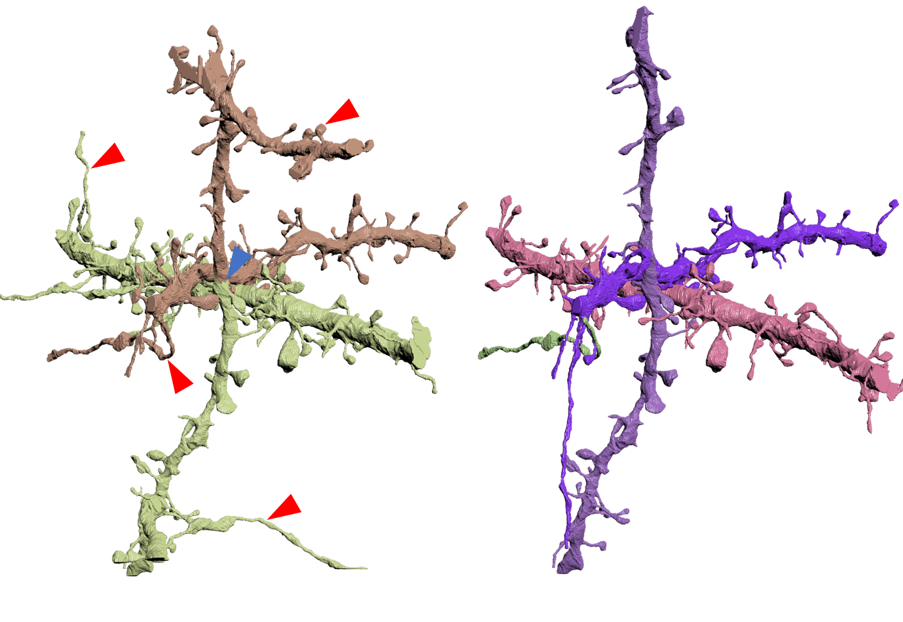
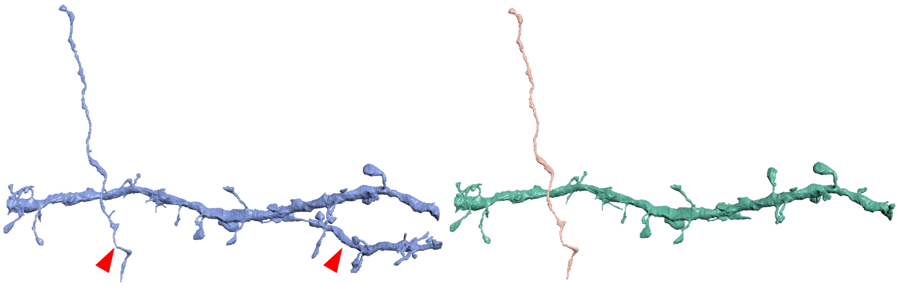
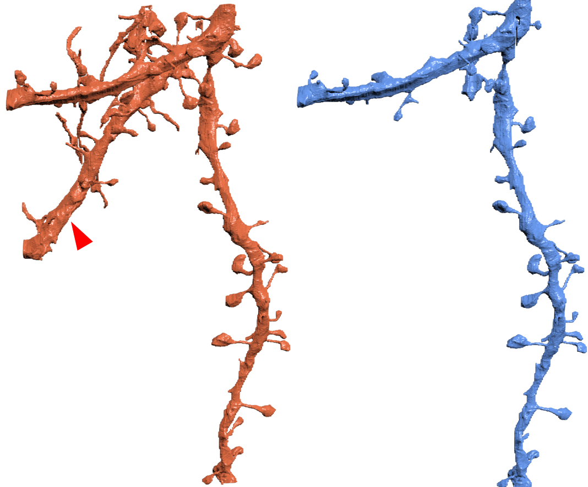

# Semi-Supervised Neuron Segmentation

Wei Huang, Chang Chen, Zhiwei Xiong, Yueyi Zhang, Xuejin Chen, Xiaoyan Sun, Feng Wu

University of Science and Technology of China


## Introduction

This repository is for the paper, "Semi-Supervised Neuron Segmentation via Reinforced Consistency Learning", where more visual results and implementation details are presented.


## Installation

This code was tested with Pytorch 1.0.1 (later versions may work), CUDA 9.0, Python 3.7.4 and Ubuntu 16.04. It is worth mentioning that, besides some commonly used image processing packages, you also need to install some special post-processing packages for neuron segmentation, such as, [waterz](https://github.com/funkey/waterz) and [elf](https://github.com/constantinpape/elf).

We strongly recommend you to pull our image if you have [Docker](https://www.docker.com/) environment as following,

```shell
docker pull registry.cn-hangzhou.aliyuncs.com/renwu527/auto-emseg:v5.4
```

or

```shell
docker pull renwu527/auto-emseg:v5.4
```


## Dataset

| Datasets   | Sizes                        | Resolutions | Species |
| ---------- | ---------------------------- | ----------- | ----------- |
| [AC3/AC4 ](https://software.rc.fas.harvard.edu/lichtman/vast/AC3AC4Package.zip)   | 1024x1024x256, 1024x1024x100 | 6x6x30 nm^3 | Mouse |
| [CREMI](https://cremi.org/)      | 1250x1250x125 (x3)           | 4x4x40 nm^3 | Drosophila |
| [Kasthuri15](https://lichtman.rc.fas.harvard.edu/vast/Thousands_6nm_spec_lossless.vsv) | 10747x12895x1850             | 6x6x30 nm^3 | Mouse |


## Training stage

### 1. Pre-training

```shell
python pre_training.py -c=pretraining_snemi3d
```

### 2. Consistency learning

```shell
python main.py -c=seg_snemi3d_d5_u200
```


## Validation stage

```shell
 python inference.py -c=seg_snemi3d_d5_u200 -mn=MODEL-PATH -id=MODEL-ITERATIONS -m=snemi3d-ac3
```


## Model Zoo

We provide the trained models on the AC3 dataset at Google drive, including the pre-trained model and the segmentation models on different numbers of labeled (\*L) and unlabeled (\*U) sections (1024x1024).

| Methods      | Models              |
| ------------ | ------------------- |
| pre-training | pre-training.ckpt   |
| 5L+200U      | ac3-5l-200u.ckpt    |
| 10L+200U     | ac3-10l-200u.ckpt   |
| 100L+200U    | ac3-100l-200u.ckpt  |
| 100L+1000U   | ac3-100l-1000u.ckpt |


## More visual results on the Kasthuri15 dataset

To demonstrate the generalizability performance of our method on the large-scale EM data, we test our models on the Kasthuri15 dataset. The quantitative results can be found in our paper. Here, we provide more visual results on the Subset3 dataset to qualitatively demonstrate the superiority of our semi-supervised method compared with the existing supervised method with full labeled data (100L).







Left images are the results of the supervised method (100L), while right images are the results of our semi-supervised method (100L+1000U), where blue and red arrows represent split and merge errors, respectively.